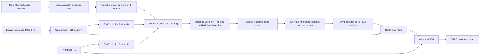

<div align="center">

# ICBFC for COXNet

### Instance-Conditioned Cross-Band Frequency Calibration for RGBT Tiny Object Detection

[](https://www.python.org/)
[](https://pytorch.org/)
[](https://github.com/open-mmlab/mmdetection)
[](LICENSE)
[](https://doi.org/10.1109/TCSVT.2025.3595147)

An experimental CLFM replacement that asks a separate frequency-fusion
question for every Thermal object instance.

</div>

## News

- **2026-09-29:** Added the complete ICBFC implementation, focused regression
  tests, real-batch GPU smoke test, and fresh three-seed GPU-0 workflow.
- **2026-09-29:** Preserved the original COXNet cross-stage FPN pairing, RGB
  DeConv, AAM/HOFM, `wf_loss`, detector head, assignment, and postprocessing.
- **Experiment status:** ICBFC accuracy and checkpoints are pending. Structural
  validation is not an AP-improvement claim.

## Framework



ICBFC keeps COXNet's four cross-stage pairs. For each detected Thermal
instance, it extracts four RGB and four Thermal Haar-band tokens, learns an
all-to-all `4 x 4` complementary relation, and selects RGB target bands with a
sparse router. Instance residuals are projected back with normalized Gaussian
supports so overlapping people do not amplify the update by count alone.

The Thermal feature itself is never overwritten. Only the DeConv-restored RGB
feature is calibrated before the unchanged AAM/HOFM. DWT is an implementation
primitive, not the claimed contribution, and this implementation is not a
copy of the full DyFCLT architecture. See [the ICBFC method note](docs/ICBFC.md)
for equations, diagnostics, and falsification criteria.

## Method at a Glance

| Design question | ICBFC choice |
|---|---|
| How are crowded tiny objects separated? | A supervised stride-4 Thermal center/offset/scale prior |
| Is the candidate count fixed? | No. All valid local maxima above threshold are processed in chunks |
| What is instance-conditioned? | Eight modality-band tokens, the `4 x 4` relation, and the four-band router |
| How are overlapping instances combined? | Gaussian numerator/denominator normalization |
| What enters AAM/HOFM? | Calibrated RGB and the original Thermal feature |
| What remains from baseline COXNet? | Cross-stage FPNs, RGB DeConv, AAM/HOFM, `wf_loss`, GFLQ, QLSAssigner, NMS |

Training uses GT geometry to ensure that every labeled object supervises the
frequency path. Inference uses only the predicted Thermal prior. The prior has
CenterNet-style center supervision plus offset and log-scale regression; no
band label, cross-modal alignment target, or fixed top-k quota is introduced.

## Results and Verification Status

| Method | Configuration | Focused tests | Real-batch GPU smoke | Seeds 0/1/2 | RGBTDronePerson AP50 |
|---|---|---:|---:|---:|---:|
| Official COXNet | `configs/coxnet/coxnet_r50_fpn_1x_rgbtdroneperson.py` | Legacy path builds | N/A | Paper result | 45.57 |
| ICBFC | `configs/coxnet/icbfc/ICBFC.py` | 33 passed locally | Pending before launch | Pending | Pending |

The COXNet number is the published Table 1 result, not a new run from this
branch. ICBFC rows will be updated only after fresh checkpoints and evaluation
logs exist. The legacy cross-stage TRPC three-seed record remains available in
[its separate result note](docs/trpc_table1_ko.md).

## Quick Start

### 1. Environment

```bash
git clone git@github.com:loosiu/COXNet_develop.git
cd COXNet_develop

pip install torch==1.10.0+cu113 torchvision==0.11.1+cu113 \
  -f https://download.pytorch.org/whl/torch_stable.html
pip install mmcv-full==1.7.0 \
  -f https://download.openmmlab.com/mmcv/dist/cu113/torch1.10/index.html
pip install -r requirements.txt
pip install setuptools==59.5.0 --force-reinstall
python setup.py develop
```

### 2. Dataset

Datasets are not tracked in git. For RGBTDronePerson, use this layout:

```text
data/RGBTDronePerson/
├── train/
│   ├── visible/
│   └── infrared/
├── val/
│   ├── visible/
│   └── infrared/
├── train_thermal.json
└── val_thermal.json
```

Alternatively, point the training process at an external dataset directory:

```bash
export MMDET_DATASETS=/absolute/path/to/RGBTDronePerson/
```

### 3. Verify the mechanism

```bash
python -m unittest \
  tests.test_models.test_utils.test_icbfc \
  tests.test_models.test_utils.test_icbfc_fusion \
  tests.test_models.test_detectors.test_icbfc_config \
  tests.test_tools.test_icbfc_launcher -v

CUDA_VISIBLE_DEVICES=0 python tools/misc/smoke_icbfc.py \
  --config configs/coxnet/icbfc/ICBFC.py
```

The smoke test loads one real training sample and requires finite, non-zero
gradients in the center/offset/scale prior, relation Q/K/V, router, output
projection, and all four DeConv paths.

### 4. Train

Fresh sequential seeds `0 -> 1 -> 2` on physical GPU 0:

```bash
bash tools/run_icbfc_seeds_gpu0.sh
```

The launcher uses a GPU-0 lock, distinct seed directories, deterministic mode,
and no auto-resume. It refuses non-empty target directories by default.

Single-run commands:

```bash
python tools/train.py configs/coxnet/icbfc/ICBFC.py \
  --work-dir work_dir/coxmamba/rgbtdroneperson/icbfc/seed0 \
  --gpu-id 0 --seed 0 --deterministic

python tools/train.py \
  configs/coxnet/coxnet_r50_fpn_1x_rgbtdroneperson.py \
  --work-dir work_dir/coxmamba/rgbtdroneperson/coxnet/seed0 \
  --gpu-id 0 --seed 0 --deterministic
```

### 5. Evaluate

```bash
python tools/test.py \
  configs/coxnet/icbfc/ICBFC.py \
  work_dir/coxmamba/rgbtdroneperson/icbfc/seed0/best_bbox_mAP_50.pth \
  --eval bbox
```

Replace the checkpoint name with the actual best checkpoint emitted by the
run; this repository does not currently ship an ICBFC checkpoint.

## Repository Map

```text
configs/coxnet/icbfc/ICBFC.py       # canonical experiment
mmdet/models/utils/icbfc.py         # prior, DWT, relation, router, reconstruction
mmdet/models/utils/fusion_strategy.py
mmdet/models/detectors/fusionnet_xo.py
tools/misc/smoke_icbfc.py           # real-batch activation/gradient check
tools/run_icbfc_seeds_gpu0.sh       # fresh sequential 3-seed launcher
tests/test_models/                   # mechanism and integration regression tests
docs/ICBFC.md                       # full method and reproducibility note
```

Prior CLFM-replacement studies are retained for controlled comparison:
[TPSC](docs/TPSC.md), [PRLDFC](docs/PRLDFC.md), [TOPC](docs/TOPC.md), and
[TRPC](docs/TRPC.md).

## Citation

ICBFC is an experimental research implementation and does not yet have a
separate publication citation. Please cite the original COXNet paper when
using the baseline:

```bibtex
@article{peng2025coxnet,
  title={COXNet: Cross-layer fusion with adaptive alignment and scale integration for RGBT tiny object detection},
  author={Peng, Peiran and Xu, Tingfa and Song, Liqiang and Zhu, Mengqi and Fang, Yuqiang and Li, Jianan},
  journal={IEEE Transactions on Circuits and Systems for Video Technology},
  year={2025},
  publisher={IEEE}
}
```

## License

Released under the [MIT License](LICENSE).

## Acknowledgements

This repository builds on [MMDetection](https://github.com/open-mmlab/mmdetection)
and the original COXNet implementation. We thank their authors and the
RGBTDronePerson contributors.
